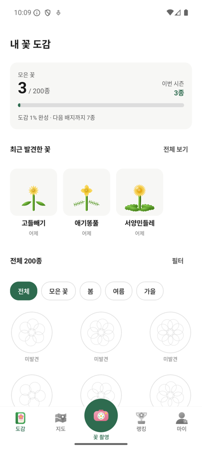
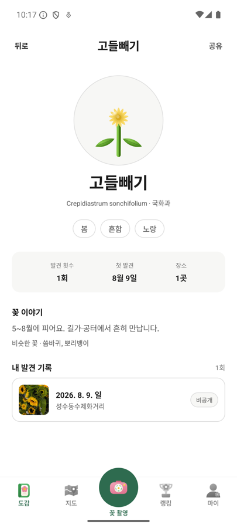
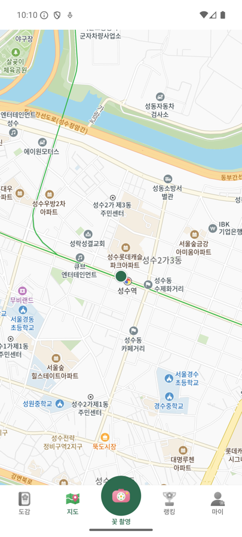
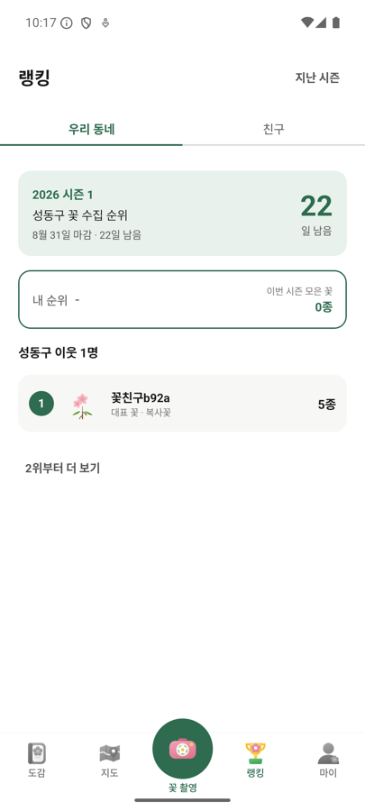
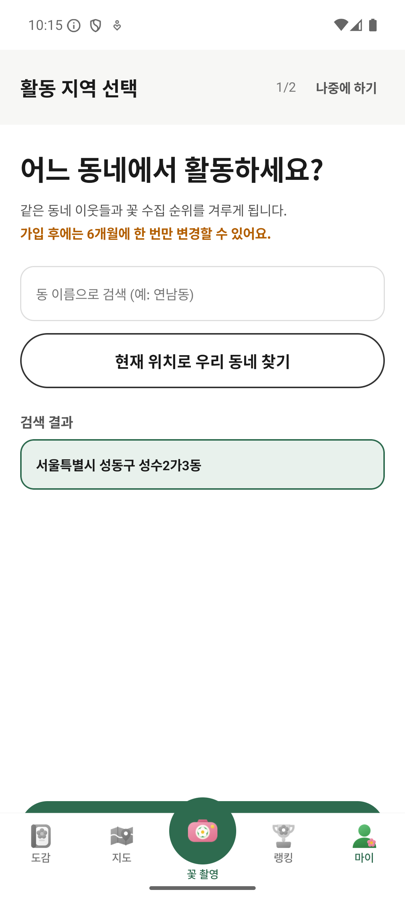
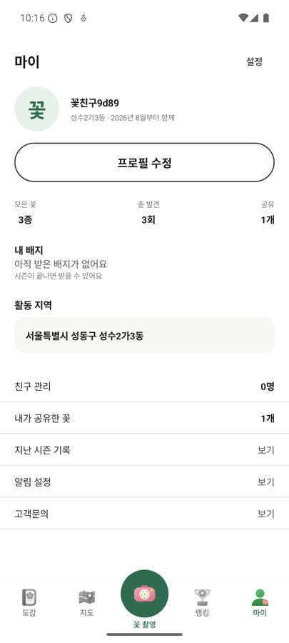

# 캐치플라워 (CatchFlower) — 게임 소개 및 설명서

**꽃을 찍으면 AI가 종을 판별해 도감에 모으고, 지도에 남기고, 동네 이웃끼리 시즌 랭킹으로 경쟁하는 모바일 게임**

| | |
|---|---|
| 플랫폼 | Android 8.0(API 26) 이상 · 실기기 확인: Galaxy A25 / Android 16 |
| 플레이 가능한 빌드 | https://github.com/Aaron-HyoSan/catchflower/releases/latest |
| 소개 페이지 | https://aaron-hyosan.github.io/catchflower/ |
| 소스 코드 | https://github.com/Aaron-HyoSan/catchflower |
| 장르 | 위치 기반 수집 · 도감 완성 · 지역 랭킹 |
| 플레이 시간 | 1회 촬영 20초 · 시즌 단위(3~8월 / 9~11월) 장기 수집 |

---

## 1. 게임 개요

### 한 줄

**포켓몬GO의 수집 재미를 실제 자연으로 옮겼다.**

몬스터 대신 **우리나라에 실제로 피는 꽃 200종**이고, 판별은 그림이 아니라 **AI가 사진을 보고** 한다.
계절이 지나면 그 꽃은 다음 해까지 못 잡는다.

### 왜 이 게임인가

수집 게임의 재미는 **"지금 여기서만 잡을 수 있다"** 는 희소성에서 온다.
그런데 가상의 몬스터는 개발자가 스폰을 정하므로 희소성이 인공적이다.

**꽃은 희소성이 이미 자연에 있다.**

| 자연이 이미 가진 규칙 | 게임이 그대로 쓴 것 |
|---|---|
| 개화기가 정해져 있다 | 8월에는 98종만 후보다. 벚꽃은 8월에 절대 안 잡힌다 |
| 지역마다 자생종이 다르다 | 동네 랭킹이 성립한다. 우리 동네에서만 나는 꽃이 있다 |
| 흔한 꽃과 귀한 꽃이 있다 | 흔함 88종 / 보통 102종 / 귀함 10종 — 데이터가 아니라 사실이다 |
| 계절이 끝나면 사라진다 | 시즌제. 놓친 꽃은 내년까지 기다린다 |

**밸런스를 우리가 설계하지 않았다. 자연에서 가져왔다.**
이것이 이 게임의 핵심 설계 결정이고, 도감 200종 데이터의 모든 컬럼(개화월·희귀도·서식지·유사종)이 여기서 나온다.

### 실제 화면

아래 6장은 **앱을 실제로 실행해 찍은 화면**이다(합성·목업이 아니다).

| | | |
|---|---|---|
| <b>도감 홈</b>200칸 중 발견한 칸만 색이 있다 | <b>도감 상세</b>학명·개화기 + 내가 찍은 사진 | <b>지도</b>카카오 벡터 타일 위의 발견 핀 |
| <b>동네 랭킹</b>서버가 센 순위 · 시즌 D-day | <b>활동 지역</b>현재 위치를 역지오코딩해 동을 찾는다 | <b>마이</b>모은 꽃 · 발견 횟수 · 공유 수 |

### 도감 200종 구성

| 구분 | 분포 |
|---|---|
| 계절 | 봄 72 · 여름 92 · 가을 30 · 겨울 6 |
| 희귀도 | 흔함 88 · 보통 102 · 귀함 10 |
| AI 판별 난이도 | 하 33 · 중 116 · 상 51 |
| 종당 데이터 | 이름 · 학명 · 과 · 개화월 · 계절 · 색 · 희귀도 · 서식지 · AI난이도 · 유사종 · 일러스트 |

각 종마다 **일러스트 1장**이 있어 아직 못 잡은 칸도 무엇을 찾아야 하는지 알 수 있다(실루엣으로 표시).

---

## 2. 플레이 방법

### 전체 흐름 — 촬영 한 번이 세 곳에 남는다

```
꽃을 찾는다  →  찍는다  →  AI가 좁힌다  →  내가 고른다  →  도감에 등록
                (화면 07)   (화면 08)      (화면 09)      (화면 10·11)
                                                              │
                                        ┌─────────────────────┼─────────────────────┐
                                        ↓                     ↓                     ↓
                                   도감 채우기            지도에 핀              동네 랭킹
                                   (화면 04·05)          (화면 13·14)           (화면 17)
```

### 단계별

**① 활동 지역을 정한다 (화면 02 · 최초 1회)**

`현재 위치로 우리 동네 찾기`를 누르면 GPS 좌표를 실제로 역지오코딩해 동을 찾는다.
직접 검색해도 된다.

> **가입 후에는 6개월에 한 번만 변경할 수 있다.** 랭킹이 걸려 있어서, 순위가 좋은 동네로
> 갈아타는 것을 막는다.

**② 꽃을 찍는다 (화면 07)**

- 꽃 한 송이를 가이드 네모 안에 꽉 채운다. 너무 멀면 AI가 잘 못 알아본다.
- **앨범 사진은 등록할 수 없다.** 직접 찍어야 한다 — 걸어 나가는 것이 이 게임이다.

**③ AI가 종을 좁힌다 (화면 08 · 약 3~5초)**

세 단계를 거친다.

| 단계 | 하는 일 | 왜 |
|---|---|---|
| 1차 필터 | 온디바이스 AI(ML Kit)가 **꽃인지** 먼저 본다 | 꽃이 아니면 유료 API를 부르지 않는다. 실측 차단율 **92.4%** |
| 개화월 압축 | 지금 피는 달의 종만 후보로 남긴다 | 8월이면 98종. 11월에 "벚꽃"이 1순위로 나오는 것을 원천 차단 |
| 종 판별 | PlantNet AI에 사진과 후보를 보낸다 | 4,932종 학습 모델. 후보에 없는 종은 버린다 |

**④ 후보 중에서 내가 고른다 (화면 09)**

AI가 단정하지 않는다. **최종 결정은 사람이 한다.**

- AI가 확신하면 1순위를 크게 보여주고 `이 꽃이에요` / `다른 꽃이에요`를 묻는다.
- 애매하면 후보 여러 개를 나란히 놓고 고르게 한다.
- 유사종(민들레류·개망초류 등)은 사람도 헷갈리므로, 여기서 사용자가 결정한다.

**⑤ 도감에 등록된다 (화면 10 · 11)**

- 처음 잡은 꽃 → **신규 등록.** 도감 칸에 색이 들어온다.
- 이미 있는 꽃 → **재발견.** 발견 횟수가 오른다.
- 같은 종 + 같은 장소(100m)는 **하루 1회만** 누적된다(도배 방지).

**⑥ 지도에 남길지 고른다 (화면 13)**

**기본은 비공개다.** 공개 범위를 사용자가 명시적으로 고른다.

| 범위 | 누가 보나 |
|---|---|
| 비공개 | 나만 |
| 친구 공개 | 친구만 |
| 동네 공개 | 같은 동 이웃 |
| 전체 공개 | 모두 |

한 줄 설명(40자)도 붙일 수 있다.

**⑦ 지도 · 도감 · 랭킹에서 확인한다**

- **지도 (화면 14)** — 카카오 지도 위에 내 발견 핀이 찍힌다. 핀이 몰리면 클러스터로 묶인다.
- **도감 (화면 04·05·06)** — 200칸 중 채운 칸에 색이 들어온다. 계절·색·희귀도로 필터. 상세에는 학명·과·개화기와 **내가 찍은 사진**이 함께 남는다.
- **랭킹 (화면 17·18)** — 같은 동네 이웃들과 이번 시즌 수집 종 수로 겨룬다. 친구 탭도 있다.

### 시즌 규칙

| | |
|---|---|
| 시즌 1 | 3월 ~ 8월 |
| 시즌 2 | 9월 ~ 11월 |
| 휴지기 | 12월 ~ 2월 |

**겨울에 피는 꽃이 6종뿐이라** 6개월씩 균등하게 자르면 한 시즌의 후반 3개월이 죽는다.
그래서 3~8월 / 9~11월로 나누고 12~2월은 휴지기로 뒀다. 휴지기에는 랭킹 대신 다음 시즌 D-day를 보여준다.

**동 인원이 10명 미만이면 구 단위로 넓혀서 순위를 매긴다.** 이웃이 2명인데 랭킹이 있어도 게임이 안 된다.

---

## 3. 실행 방법

### 방법 1 — APK 설치 (가장 빠름)

1. https://github.com/Aaron-HyoSan/catchflower/releases/latest 접속
2. `catchflower-v1.0.apk` (약 105MB) 를 **안드로이드 폰**으로 내려받는다
3. `설정 → 보안 → 출처를 알 수 없는 앱` 허용 후 설치
4. 실행 → 카메라 · 위치 권한 허용 → 활동 지역 선택 → 꽃 촬영

> 계정 생성이 필요 없다. **익명 로그인**으로 바로 시작한다.

### 방법 2 — 소스에서 빌드

```bash
git clone https://github.com/Aaron-HyoSan/catchflower.git
cd catchflower/android
cp local.properties.template local.properties   # 아래 키를 채운다
./gradlew :app:assembleDebug
adb install -r app/build/outputs/apk/debug/app-debug.apk
```

필요한 환경(임의로 올리면 빌드가 안 된다):

| | 값 |
|---|---|
| JDK | 21 |
| Gradle | 9.6.1 |
| Android Gradle Plugin | **9.3.1** (8.x는 빌드 불가) |
| compileSdk / minSdk | 36 / 26 |

`local.properties`에 넣는 키 4개:

```properties
PLANTNET_API_KEY=...
KAKAO_REST_API_KEY=...
KAKAO_NATIVE_APP_KEY=...
SUPABASE_ANON_KEY=...
```

**키가 없어도 앱은 죽지 않는다.** 판별은 Mock으로 돌고, 지도·장소명 기능만 꺼진다.

### ⚠️ 지도가 안 보이면

카카오 콘솔에 **빌드에 쓴 키스토어의 SHA-1 키해시**를 등록하지 않으면 `vector/auth`가 **401**을 주고
타일이 그려지지 않는다. 화면에는 회색 배경만 보이고 오류 메시지는 없다.

배포한 APK는 **키해시가 이미 등록된 디버그 키**로 서명했다. release 키로 다시 서명하면 지도만 조용히 죽는다.

---

## 4. 지금 되는 것 / 안 되는 것

화면 22개 중 **19개가 동작한다.**

**되는 것 (실기기 또는 에뮬레이터로 확인)**

| | 확인 방법 |
|---|---|
| 도감 홈·상세·필터·빈 상태 (04·05·06·22) | 실기 · 일러스트 200장 표시 |
| 촬영 ~ 판별 (07~12) | **실기기에서 PlantNet 실호출로 동작** |
| 랭킹·친구·마이 (17~21) | 실기 · 서버가 센 순위 |
| 온보딩·활동지역 (02·03) | 실기 · 역지오코딩으로 동 코드 저장 확인 |
| 지도 공유·지도 홈 (13·14) | 실기 · 카카오 벡터 타일 위에 핀 |

**안 되는 것 — 이유까지 밝힌다**

| 화면 | 상태 | 이유 |
|---|---|---|
| 01 로그인 | 미구현 | Supabase의 kakao·apple provider가 꺼져 있다. **익명 로그인으로 대체**해서 플레이에 지장이 없다 |
| 15 장소 상세 | 미구현 | 예선 범위 밖 |
| 16 기록 상세 | 미구현 | 예선 범위 밖 |
| 이웃 N명 활동 중 | 안 보임 | 서버 함수 `dong_member_count` 미배포(`PGRST202`). 값이 없으면 **문구를 감춘다** — 0명으로 보여주지 않는다 |

**아직 좁은 것 (알고 있는 한계)**

도감이 200종인데 **속(genus)이 143개뿐이라** PlantNet의 답이 도감에 없어 걸러지는 경우가 있다.
캐시된 실측 200장 중 130장에서 후보가 1개만 남았다 — "후보 3개 중 고르기"가 자주 발동하지 않는다.
**유사종 통합 정책이 확정되면 해결되는 데이터 문제**이고, 코드 문제는 아니다.

---

## 5. 기술 구성

| 층 | 사용 기술 |
|---|---|
| 앱 | Kotlin · Jetpack Compose · CameraX · Android Gradle Plugin 9.3.1 |
| 온디바이스 AI | ML Kit Image Labeling (번들 모델 · 과금 없음) |
| 종 판별 AI | PlantNet API `k-eastern-asia` (4,932종) |
| 지도 | 카카오맵 SDK (벡터 타일 · 핀 · 클러스터링) + 카카오 로컬 API(역지오코딩) |
| 백엔드 | Supabase — Postgres + Row Level Security + 익명 인증 |
| 순위 계산 | Postgres 함수(`region_ranking` · `friend_ranking`) — 클라이언트가 세지 않는다 |
| iOS | SwiftUI로 동시 개발 (7,416줄) |

**규모**

| | |
|---|---|
| Android 본체 | 14,789줄 (71 파일) |
| Android 테스트 | 10,084줄 (44 파일) |
| iOS | 7,416줄 (47 파일) |
| 문서 | 11,377줄 (21 파일) |
| 개발 기록 | (49)회차 (`프로젝트 맥락/진행.md` 4,770줄) |
| 검증 | JVM 테스트 409개 · 계측 테스트 45개 · **돌연변이 검증 182건** |

---

## 6. 설계에서 가장 신경 쓴 것 4가지

### 1. 유료 API를 함부로 부르지 않는다

온디바이스 필터가 **92.4%** 를 미리 걸러내고, 개화월 후보가 0개인 달(겨울)에는 **네트워크를 아예 타지 않는다.**

호출 **직전**에 로그를 남겨 **어느 촬영이 과금됐는지 사후에 확인**할 수 있게 했다.
"몇 건 썼는지 모른다"는 상태를 만들지 않았다.

### 2. AI 점수를 신뢰도로 착각하지 않았다

PlantNet 점수는 4,932종에 퍼진 확률이라 **정답도 0.1 근처에 흔히 온다**(정답 사진의 25% 분위가 0.157).

처음 실패 임계값을 0.30으로 뒀더니 **버려진 4장이 전부 정답**이었다(실기기 실측 —
장미 0.110 · 서양민들레 0.112 · 0.185 · 0.019).

| 임계값 | 1순위 정답률 |
|---|---|
| 0.30 (처음) | 50% |
| 0.10 | 76% |
| **0.05 (현재)** | **80%** |

낮춰도 오등록이 늘지 않는 이유는, 이 값이 "확정" 관문이 아니라 **"후보로 보여줄 자격"** 이기 때문이다.
점수가 낮으면 화면 09에서 **사용자가 고른다.**

### 3. 실패 화면이 원인을 가리지 않게 했다

`어떤 꽃인지 알 수 없었어요`는 원인이 셋인데 **화면에는 똑같이 보인다.**

| | 원인 | 우리 책임인가 |
|---|---|---|
| ⓐ | PlantNet이 아무것도 못 알아봤다 | 아니다 (API 한계) |
| ⓑ | 알아봤지만 도감 200종·개화월에서 전부 걸렸다 | **우리 도감이 좁다** |
| ⓒ | 통과했지만 점수가 임계값 미달이다 | **우리 정책이다** |

로그 네 줄로 갈라 두고, **그 로그의 내용까지 테스트로 고정**했다 — 로그는 조용해져도 증상이 없기 때문이다.
실제로 이 구분이 없어서 "API가 문제인 줄 알았는데 우리 임계값이었다"를 한 번 겪었다.

### 4. "테스트가 초록"을 증거로 쓰지 않았다

**테스트 249개가 전부 통과한 상태에서 앱이 죽고 화면에 `null`이 떠 있었다.**

JVM 테스트로 **원리적으로 측정할 수 없는 층**이 있다는 것을 문서화하고
(`AndroidViewModel` 초기화 순서, 기기와 다른 JSON `null` 동작),
**돌연변이 182건**으로 "이 검사가 실제로 빨개지는가"를 매번 확인했다.

에뮬레이터로 프레임 성능을 재려다 실패한 것도 기록에 남겼다 —
소프트웨어 렌더러라서 **문제 코드를 안 부르는 대조군이 더 나쁘게 나왔다.**

---

## 7. 함께 보는 문서

| 문서 | 내용 |
|---|---|
| `제출물/AI_활용_기술문서.pdf` | AI 도구 · 프롬프트 · 활용 내역 |
| `제출물/팀원_롤_기술서.pdf` | 팀원별 역할 · 담당 영역 |
| `프로젝트 맥락/진행.md` | 개발 전 과정 (49)회차 — 결정과 근거, 밟은 함정 전부 |
| `프로젝트 맥락/구현현황_AOS.md` | 무엇이 되고 무엇이 안 되나 (이유까지) |
| `프로젝트 맥락/공유계약_iOS_AOS.md` | iOS·Android가 혼자 못 바꾸는 것 |
| `디자이너_업무/A_문구·버튼_스펙.md` | 화면 문구 전체 |
| `와이어프레임/index.html` | 화면 22개 + 흐름도 2장 |
